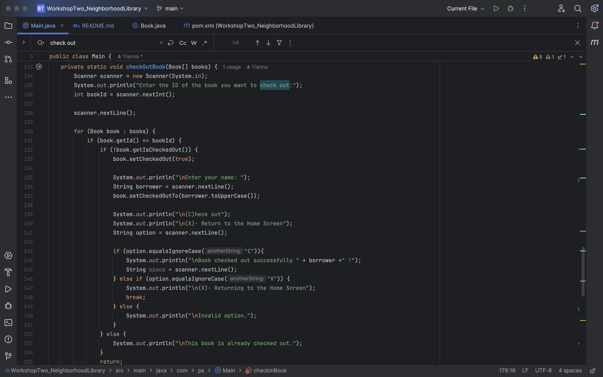

# WorkshopTwo_NeighborhoodLibrary

## Understanding the problem

- Inputs
    - User input
  
- Outputs
    - Command-Line Interface (CLI)
- Creating an application that allows the user to check in and out books from their neighborhood library

## Making a plan
``
// Pseudocode
//Inputs
    // Using Scanner to take an initial user menu command
    // First asking to show which books are available, show the checked out books and to exit the application.
    // After the prompt the use will input a number
    // There will be a menu for each option except the exit option to allow the user to either check out a book or check a book in
//Outputs
    // Print to the CLI the result of the user options
``
## User Stories

- User will be able to input a command in the CLI in order to check in or check out a book from the library
- User will be able to see all the books available 
- User will be able to see all books checked out
- User will be able to navigate between each menu with the CLI using the inputs
- User will be able to check in a book and check out a book 
- User will be able to exit the application

## Developers Favorite Piece Of Code  

In this code block it is displaying a static method called CheckOutBook which will handle the user checking out a book. 

### Explanation of code :

The Static method CheckOutBook takes in the parameters Book[] and books. 
Book[] is an array and books is a variable to keep track of the books. 
I used Scanner to be able to receive an input from the user. 
I used an integer data type to be able to receive their chosen option.
I used a for loop and two nested if statements. 
The for loop looped through the array and checked the id of the input and the array to make sure the id matched to the data on file.
I used an if conditional statement and created a menu for the user to be able to enter the name so the library can keep track of who checked out the book.
The user had was prompted with two options to either check out the book or return back to the home screen.
If the user decided to check out they would be prompted with the would receive Book check out successful with their name.
I also put in some error messages if the book is already checked out or if the user put in an invalid option.

### Why is this piece my favorite?

This piece is my favorite because it challenged me the most to figure out why the check out was not working and was the code looping through correctly. 
I had to really think this out through, I used a handwritten diagram to make sure I knew how I wanted the menu to be formatted. 
But I am glad that I was able to work through it! 